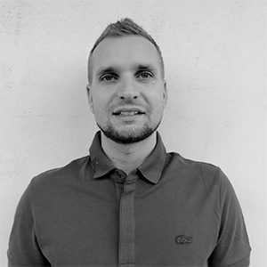
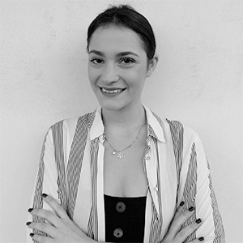

# 👀 Our Team

### Scientific Lab Leaders



<figure><figcaption>
Scientific Lab Leader
</figcaption></figure>

_**Blockchain, Distributed Ledger Systems, Machine Learning, Data Management**_

**Dr. Klitos Christodoulou** is a faculty member at the Department of Management and MIS – Digital Currency, at the University of Nicosia (UNIC). He is also a research faculty at the Institute For the Future (IFF) at the same University since 2018.

He holds a B.Sc. in Computer Science and an M.Sc. in Advanced Computer Science – with specialisation in Advanced Applications, both from the University of Manchester, UK. In 2014, Klitos obtained his Ph.D. in Computer Science from the School of Computer Science at the University of Manchester, UK. He has been an adjunct staff member of the Information Management Group (IMG) in the School of Computer Science, at the University of Manchester where he engaged in various research and teaching activities.

Klitos has served in the Program Committee of a variety of conferences. Currently, he serves as an Associate Editor at the Frontiers in Blockchain Journal and Guest Editor on the special issue of Future Internet (MDPI Journal) on Blockchain Applications.

His research interests span both Data Management challenges, with a focus on Machine Learning techniques, and Distributed Ledger Technologies; with an emphasis on Blockchain ledgers. He has given numerous invited talks and tutorials involved Blockchain technologies. Klitos teaches a course on Blockchain Applications under UNIC’s MSc in Digital Currency programme.



<figure><figcaption>
Scientific Lab Co-Leader
</figcaption></figure>

**Dr. Elias Iosif** is a senior researcher at the Blockchain Initiative – Institute For the Future at the University of Nicosia.Dr. Iosif received the PhD degree from the School of Electronic and Computer Engineering, Technical University of Crete (TUC), Greece, in 2013. From 2007-2013, he was a research assistant and a postdoctoral fellow at TUC, where he participated in a number of EU projects. From 2014 to mid-2017, he has been a post-doctoral researcher at the School of Electrical and Computer Engineering, National Technical University of Athens, Greece. His areas of expertise include blockchains, machine learning, human language technologies (natural language processing, spoken dialogue systems) and data mining, where he has authored/co-authored over 50 peer-reviewed scientific publications.



### Lab Researchers and PhD Students



<figure><figcaption>
IFF Post-doctoral Researcher, Activity Manager CEPOL 
</figcaption></figure>

_**Blockchain, Distributed Ledger Systems, Information Systems**_

Dr. Leonidas Katelaris is a post-doctoral researcher at the Institute for the Future (IFF) at the University of Nicosia. He has played a crucial role in the successful implementation of UNIC's open course on NFTs and the Metaverse, marking the first-ever university course to be delivered on-chain and within the metaverse. Leonidas joined the Institute for the Future (IFF) at the University of Nicosia in 2019 as a researcher, participating in EU projects with a focus on blockchains, DLTs, NFTs, and the Metaverse. His contributions to the Institute for the Future (IFF) at the University of Nicosia span various roles and responsibilities, including:

* Lecturer/Trainer for the Cyprus Police course on investigations in digital currencies
* Activity Manager for the European Union Agency for Law Enforcement Training (CEPOL) training course hosted by the University of Nicosia
* Teaching Assistant for the world leading Blockchain and Digital Currency MSc program at the University of Nicosia
* Researcher at the Distributed Ledgers Research Centre (DLRC)
* Member of the team behind the Open Metaverse Initiative (OMI) at the University of Nicosia

He holds a B.Sc. and M.Sc. in Digital Systems, both with a specialization in Network Oriented Systems from the University of Piraeus. His M.Sc. thesis focused on "Optimized Resource Provisioning based on Collective Intelligence in Service Level Agreements in Cloud Computing." Leonidas obtained his Ph.D. in Information Systems from the Department of Digital Systems at the University of Piraeus, where his dissertation was titled "Innovative Customer Behavior Forecasting Framework for Subscription-based Organizations." His areas of expertise include Information Systems, Blockchain, DLTs, Non-fungible Tokens (NFTs), and the Metaverse, and he has authored and co-authored numerous scientific publications in these domains.




<figure><figcaption>
IFF Researcher, PhD Candidate, Ripple Fellow
</figcaption></figure>

Mr. Marios Touloupou(male) received his B.Sc. degree in Digital Systems from the Department of Digital Systems of the University of Piraeus. The topic of his diploma thesis was “Three-Dimensional Web Platform for Multimedia Data Management (Applying the Approach to the Data of the Holy Sepulcher Restoration Project)”, where he delivered a set of innovative mechanisms that focus on “Data as a Service” technology to integrate big data management into cloud environments.

He also received his master’s degree in the Department of Digital Systems of the University of Piraeus, while he followed the direction of “Advanced Information Systems & Services”. His diploma’s thesis topic was “5G and V\&V: Estimation of Performance in 5th Generation Network Services – Targeted Validation and Verification Tests”.

Since 2017, he was a researcher at the Research Center of the University of Piraeus, having high interest on 5G/SDN networks, and focusing not only on the technology aspects but also on real life events – by adopting innovative tools that meet the needs of the ICT industry. He has participated and contributed in research projects (e.g. 5GTANGO) realized in the context of EU Programmes, and his research interests are in the field of data management throughout the software life cycle, and the enforcement of service quality through the monitoring of resources in full distributed systems. Currently, he is a researcher at Institute for the Future (IFF) in University in Nicosia, Cyprus.

His research area is now at distributed ledger technologies (DLTs) while he is participating in Ripple research program (An opensource and peer-to-peer decentralized platform that allows for a seamless transfer of money in any form, whether USD, Yen, Litecoin, or bitcoin). Marios is also a PhD candidate at University of Nicosia while his thesis topic is “Analysis and Optimization of Consensus Algorithms in different Decentralized Networks”.



<figure><figcaption>
IFF Researcher, PhD Candidate
</figcaption></figure>

Ms. Evgenia Kapassa (female) received her B.Sc. degree in Digital Systems from the Department of Digital Systems, University of Piraeus, Greece. Her thesis topic is “Web Platform for the storage and retrieval of geo-referenced data in 3D models” where she delivered a set of innovative mechanisms, focused on Data as a Service technologies, to integrate big data management in cloud environments. She received her M.Sc. degree in Advanced Information Systems, also from the Department of Digital Systems, University of Piraeus, Greece. Her diploma thesis was a “Complete Service Level Agreements Management Framework in 5G Environments”, focusing on the management of the Network Services’ lifecycle, taking into consideration QoS and QoE parameters from heterogenous recourses. Since 2017, she has been a researcher at the Research Center of the University of Piraeus focusing on 5G/SDN networks with an emphasis not only on technology-specific aspects but also on real-world cases-adopting cutting-edge and high-impact approaches that address the ICT industry needs.

Currently, she is a PhD candidate in University of Nicosia, Cyprus, focusing on the investigation of V2G/V2V energy trading concept using blockchain technology. At the same time is a Research Assistant in the Institute for the Future at the University of Nicosia working on the integration of blockchain technology in the renewable energy sector, emphasizing on blockchain based local flexibility market platform (LFM) tools and services. She has participated and contributed in research projects (e.g. 5GTANGO, PARITY) realized in the context of EU Programmes, and her research interests are in the fields of data management across the software lifecycle, quality of service enforcement, IoT management, distributed ledger technologies and future generation networks.



<figure><figcaption>
IFF Researcher, PhD Candidate
</figcaption></figure>

Stamatis (Manos) Papangelou is a PhD candidate and researcher in the DLRC.

Stamatis holds a Bachelor Degree in Economics from University of Macedonia in Greece. He also holds a MSc in Data Science from International Hellenic University and graduated with honors.

Stamatis shows his passion about Blockchain technologies from his early part of his academic carrier with Bachelor thesis titled: _Digital Currencies: A Multivariate GARCH Approach_ and Master Thesis titled: _Chaotic pattern assessment and exploitation in Blockchain Technology_. Stamatis also holds publications on the fields on blockchain, forecasting and dynamics of disaster.

His current PhD research focuses on the decentralization and autonomous aspects of a DAO in the DeFi ecosystem. The ambition of his study is to categorize and measure decentralization levels of DeFi protocols and study how can Artificial Intelligence can promote autonomous financial services.



<figure><figcaption>
PhD Candidate
</figcaption></figure>

Andreas is a Blockchain professional with more than 5 years of experience in the Private sector and in Business Development. During the years 2019-2020, Andreas has been working for the educational platform ODEM.io ([https://odem.io/](https://odem.io/)) as the Director of Business Development in Europe and Middle East facilitating collaborations with prominent universities, educational organizations and individuals.

During the years 2015-2019, Andreas has been working at the University of Nicosia focusing on the Blockchain Initiative and specifically the construction of academic material, external partnership relations and coordination of the MSc in Digital Currency Degree. He has been the leading contact of partnerships with prominent Blockchain organizations like Hyperledger, R3 and the EU Blockchain Observatory Forum as well as several universities around the world. He has managed the formation of “Decentralized” Meetups around the world where people within the blockchain community meet regularly and host events/seminars. Andreas has been managing the content of the course “Introduction to Digital Currencies” which has been offered to more than 40,000 students all over the world.





<figure><figcaption>
PhD Candidate
</figcaption></figure>

Enrico Zanardo is a computer scientist with over 20 years of experience across algorithms development, distributed systems, and cryptography. He is the creator of AcademicCoins and MyPerformances, a meritocratic e-learning system based on blockchain technologies.

Before starting a private business founding the OneZero Binary Limited, Enrico spent about seven years as a computer scientist at the Free University of Bolzano-Bozen. After a successful career helping private and public companies to be involved into the Blockchain market, Enrico now trains them on how to integrate the ultimate technologies for their products and services.

Enrico enjoys mathematics, machine learning and study at the University of Nicosia where he is a PhD Student.



<figure><figcaption>
Ripple MSc Scholar
</figcaption></figure>

Fady Aro is a crypto enthusiast, developer, computer and communications engineer.

Currently working at the Digital Factory – CMA CGM. Previously he worked as a Business Technologist at E-Banking – Credit Libanais a distinguished pioneer banking institution. and as a Payments Solutions Engineer as eMcREY, a Fintech company serving major banks in KSA and the MENA.

He graduated from the Lebanese University with a Masters degree in Electrical Engineering and Advanced Telecommunications Networks.



<figure><figcaption>
IFF Blockchain &#x26; Full Stack Developer
</figcaption></figure>

Mr. George Michoulis received his B.Sc. degree in Applied Informatics from the Department of Applied Informatics, University of Macedonia, Greece. His thesis topic is “Verification of Academic Qualifications through Ethereum Blockchain” where he delivered a set of innovative mechanisms, focused on Blockchain technologies, Consensus mechanisms, and Blockchain-based Academic approaches comparison to understand and develop our own Ethereum-based approach, named VerDe (Verified Degrees). More than 3 times this thesis was published at scientific conferences. VerDe is also a project that has received funding from the Research Committee of the University of Macedonia under the Basic Research 2020-21 funding programme.&#x20;

He also holds an MSc in Data and Web Science from the Aristotle University of Thessaloniki. His diploma thesis was "Graph Embedding and Node Features for Drug-Target Interaction Prediction" where he developed a Classification (Link Prediction) and a Regression system that finds new interactions (drug discovery). This was implemented utilizing edge technologies such as Python, PyTorch, and Pytorch Geometric. This thesis and MSc studies were conducted under a fully-funded scholarship from DeepMind Technologies Limited. Currently, he is a Full Stack / Blockchain Developer at the Institute for the Future at the University of Nicosia working on developing web applications (WordPress, Javascript Frameworks, AWS SDK, NoSQL, Python, APIs, Web3) and blockchain applications.




_**IFF Full Stack Developer & Machine Learning Engineer**_

&#x20;

Vasileios (Will) Moschopoulos is a Full Stack Developer and a Machine Learning Engineer at IFF. He holds a MSc in Data & Web Science as a DeepMind scholar from the Aristotle University of Thessaloniki and a BSc in Computer Science from the Alexander Technological Educational Institute of Thessaloniki.

His BSc thesis titled "Parallel and Distributed Implementation of Recommendation System Algorithms" focused on the development of distributed Recommendation System algorithms.His MSc thesis titled "Reward Shaping in Reinforcement Learning for Multi-Agent Physics Games" focused on the development of novel reward shaping techniques applied on the game of Rocket League. The thesis was part of a collaborative effort published on the top AI conference IJCAI. He has a passion for learning, research, Blockchain, Machine Learning, Reinforcement Learning and medical sciences. His ambition is to combine a number of technologies and domains, unifying them in a common framework.

&#x20;



### Ecosystem Collaborators

The Lab welcomes like-minded individuals and enthusiasts with technical expertise (Blockchain Developers, Distributed Ledgers, Data Analytics, NFTs, Metaverse, etc.) from the wider blockchain ecosystem. Our vibrant community fosters collaboration and innovation across these cutting-edge fields.

**Opportunities for individual researchers to join the Lab and create synergies.**

[<mark style="color:red;">**Get involved**</mark>](https://www.unic.ac.cy/iff/dlrc/dlrc-research-engagement/)
